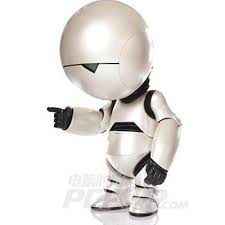
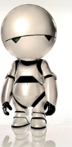

<table align="right">
  <tr>
    <td><b>Author:</b></td>
    <td>Andre Marais</td>
  </tr>
  <!--<tr>
    <td></td>
    <td>Jason Perlow</td>
  </tr>-->
</table>

------------------

    
    
    

# Robots will take over, but at least we'll be bored

The idea that humans will share this world with robots one day is not new to us. Two of the most notable authors that cemented these dreams and fears in our minds are Arthur C Clarke and Isaac Asimov with works like Foundation, 2001 A Space Odyssey and I Robot. These novels are eerily accurate, especially if you consider they are more than 50 years old. I sometimes wonder if we’re building towards the worlds envisioned by these authors, or were they just excellent anthropologists who saw how humans are marching down a very predictable path. 

Every month there are new videos on YouTube or TED  talks that discuss Artificial Intelligence (AI) and how it will affect humanity. I think it was only after Deep Mind’s AlphaGo algorithm beat the Go world champion, Lee Sedol, back in March 2016 [1] that people started to notice that AI is not a buzzword anymore. It showed us that machines can learn intuition. The game Go relies on very few rules, but depends on nuances and long term strategies that will be almost impossible to capture programmatically. While this is very niche application of AI, it does show that we can teach machines how to learn new skills.  

While we don’t have to worry about our toasters’ feelings just yet, the idea that robots will be part of our daily lives in 10 or 20 years seem… expected.  The big talk these days revolve around self-driving cars. It’s estimated that self-driving cars will replace up to 4 million jobs in the United States alone [2]. But the boat doesn’t stop there:, Mcdonald’s is looking to automate large chunks of its business - as it’s becoming cheaper to use robotics than to employ staff at minimum wage. AI will become better and better at doing monotonous jobs, which is something to worry about. The bigger worry though, is over time machines will become better at doing jobs we thought only humans can do. Detecting pathogens, design structures, create nice melodies to listen to and even write movie scripts (not good ones, but let’s just call it modern art).

So where will this leave us? The tech prophets of doom tell us that most of us will lose our jobs. Initially only middle class, but over time upper- and lower class jobs will also be replaced by robots. This does look grim indeed - joblessness is already plaguing major parts of the world, and our march down this road won’t make it any better. 

But this is where things can become interesting. Human beings have this amazing ability of becoming bored. Usually there is a bad sentiment that goes with the idea of boredom, but boredom is basically our brains telling us: Hey, you’re not doing something constructive. Boredom is what reminds us that we can do something better with our time. Sure, we can play games on our cellphones or not-read Facebook posts, but even that will bore you after a while. Boredom is what drives us to change our environment. Jennifer Schuelssler wrote in an interesting essay about boredom [3]. She says that boredom can act as an important source of creativity, well-being and our very sense of self. 

So yes, we’ll be jobless for quite a while. Much like the industrial age, the robotics age will force humanity to adapt to a new world. Widespread joblessness will be pandemic, but over time humanity will create a new niche for itself in this world. We lived with dinosaurs, we lived through all different plagues, we survived two world wars and we didn’t nuke this world into oblivion. Living with robots might just seem like the logical next thing to do. 

[1]: "AlphaGo | DeepMind." 28 Jan. 2016, https://deepmind.com/research/alphago/

[2]: "Self-Driving Vehicle Revolution to Wipe Out 4 Million Jobs | Wolf Street." 14 Sep. 2016, http://wolfstreet.com/2016/09/14/self-driving-vehicle-revolution-to-wipe-out-4-million-jobs/.

[3]: "Our Boredom, Ourselves - The New York Times." 21 Jan. 2010, http://www.nytimes.com/2010/01/24/books/review/Schuessler-t.html